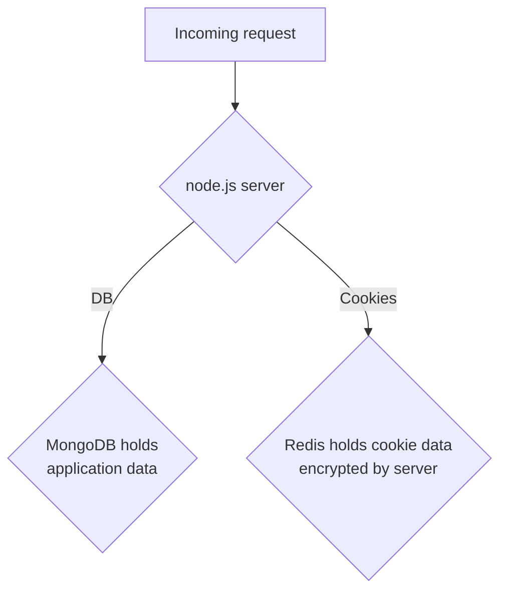

# Humanitarian ID

Humanitarian ID is built with:

- mongoDB as its database backend
- node.js + hapi as the server

HID acts as an OAuth 2.0 and OpenID Connect server.

The API is documented here: https://api.humanitarian.id/docs/

## Models

* User: the main and most important model of the API: it stores all the information related to a user
* Client: an OAuth client application
* JwtToken: a blacklisted JSON Web Token stored in the database
* OauthToken: an OAuth token

## Controllers

* AdminController: handles UI for HID Admins.
* AuthController: handles the creation of JSON Web Tokens and the OpenID Connect process
* ClientController: CRUD for OAuth clients
* UserController: CRUD and multiple user related endpoints
* ViewController: handles UI for HID Auth functions (OAuth + OpenID Connect) and general account management (profile + settings).

## Routes

Routes map API endpoints to their respective controller methods. Routes are defined in the `config/routes.js` file.

## Policies

Policies provide access control for the controller methods.

* AuthPolicy: defines policies to determine if a user is authenticated and if a user is an administrator or not
* UserPolicy: determines if a user can access controller methods of UserController

## Services

Services are helper methods provided to the controllers.

* EmailService: service to send emails
* HelperService: various helper functions for controllers
* JwtService: issues and verifies JSON Web tokens

## Configuration files

Configuration files are stored in `/config`.

* log.js: configure logging
* main.js: configure trailpacks and paths
* routes.js: configure routes
* session.js: configure sessions when authenticating with OpenId Connect
* web.js: used to configure the web server (hapi)

## Diagram

