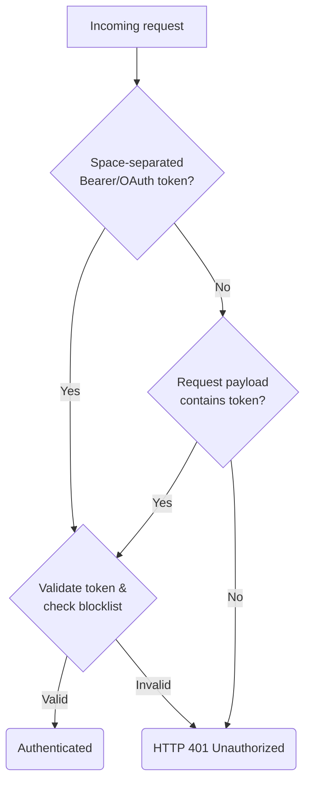

# HID Token Auth schema

This is a custom authentication schema for Hapi that enforces JWT token authentication for our API and OAuth operations.

```mermaid
flowchart TD
  Incoming[Incoming request] --> Formatted{Space-separated\nBearer/OAuth token?}
  Formatted -->|Yes| Validate{Validate token &\ncheck blocklist}
  Formatted -->|No| Payload{Request payload\ncontains token?}
  Payload -->|Yes| Validate
  Payload -->|No| Unauthorized(HTTP 401 Unauthorized)
  Validate -->|Valid| Authenticated(Authenticated)
  Validate -->|Invalid| Unauthorized
```
