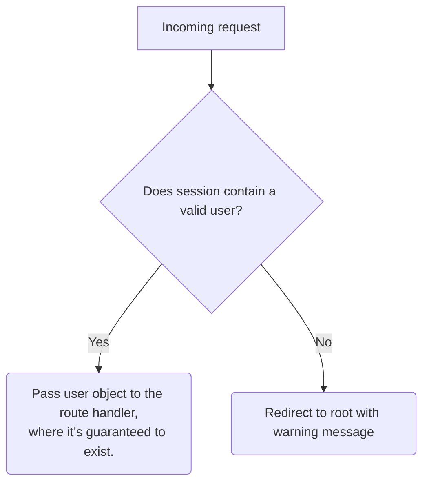

# HID Session Auth schema

This is a custom authentication schema for Hapi that leverages our existing implementation of `yar` and all of its configuration: caching, encryption, and so forth.

```mermaid
flowchart TD
  A[Incoming request] --> B{Does session contain a valid user?}
  B -->|Yes| C(Pass user object to the route handler,\nwhere it's guaranteed to exist.)
  B -->|No| D(Redirect to root with warning message)
```
